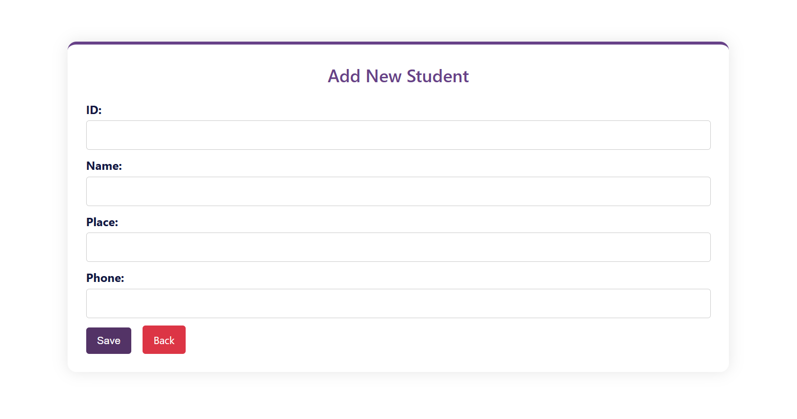
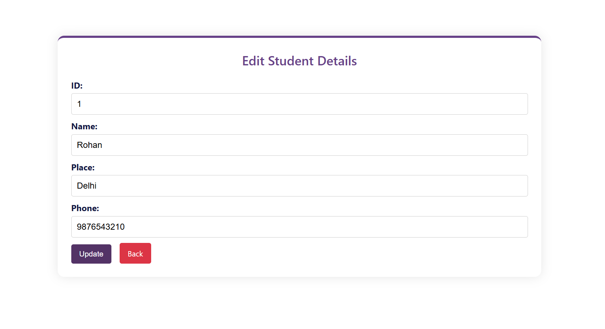
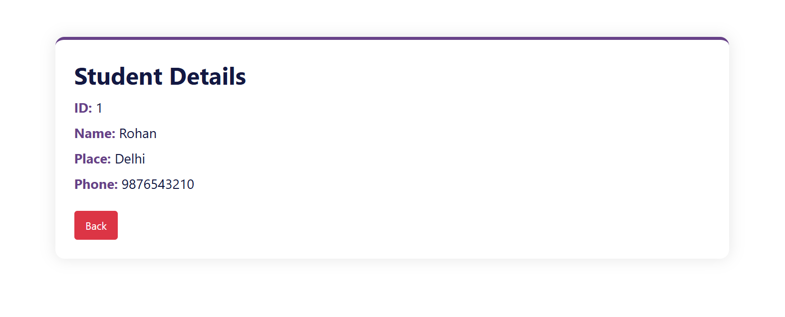
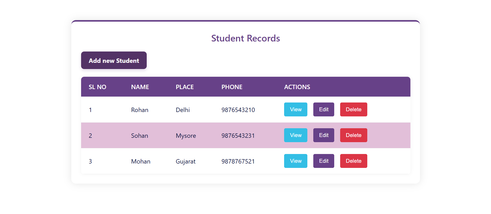

# React CRUD with API Integration

This is a simple CRUD (Create, Read, Update, Delete) application built with React and JSON Server. It manages student records with operations for adding, editing, viewing, and deleting students.

## Features

- **Add New Student**: Create a new student record.
- **Edit Student**: Modify existing student details.
- **View Student**: Display details of a student.
- **Delete Student**: Remove a student from the database.

## Installation

### 1. Clone the Repository

```bash
git clone https://github.com/AmanKumarSinhaGitHub/React-CRUD-with-API-Integration.git

cd react crud
```

### 2. Install Dependencies

Navigate to the project directory and install the required dependencies:

```bash
npm install
```

### 3. Run the React Application

To start the development server:

```bash
npm run dev
```

### 4. Set Up JSON Server

JSON Server is used to simulate a backend API. Install it globally:

```bash
npm install -g json-server
```

Run the JSON Server with the provided `db.json` file:

```bash
json-server --watch db.json --port 8000
```

### 5. Access the Application

Open your browser and navigate to:

```
http://localhost:5173
```

Ensure the JSON server is running at `http://localhost:8000` for API requests.

## db.json

The `db.json` file contains the initial data for the students:

```json
{
  "students": [
    {
      "id": "1",
      "name": "Rohan",
      "place": "Delhi",
      "phone": "9876543210"
    },
    {
      "id": "2",
      "name": "Sohna",
      "place": "Mysore",
      "phone": "9876543231"
    },
    {
      "id": "3",
      "name": "Mohan",
      "place": "Gujarat",
      "phone": "9878767521"
    }
  ]
}
```

## File Structure

- `src/App.js`: Main component handling routes.
- `src/StudentTable.jsx`: Displays the list of students.
- `src/CreateStudent.jsx`: Form to add a new student.
- `src/EditStudent.jsx`: Form to edit an existing student.
- `src/ViewDetails.jsx`: Displays details of a specific student.

## Available Routes

- `/`: List all students.
- `/student/create`: Create a new student.
- `/student/edit/:studentid`: Edit a student by ID.
- `/student/view/:studentid`: View student details by ID.

## Technologies Used

- **React**: Frontend framework.
- **JSON Server**: Simulated REST API.
- **React Router**: For navigation.

## Preview

- 
- 
- 
- 

## Acknowledgements

A special thanks to Udemy Instructor Khaiser Khanam for this course. I have learned a lot from this course.


[Course Link](https://www.udemy.com/share/10bFjj3@pAEPtiZlZONoK8VNGDLAjqWYvPfBZS2kpsTl_xbcoBIKAEiDAWQ6LK29Ex8OuPW8Wg==/)
